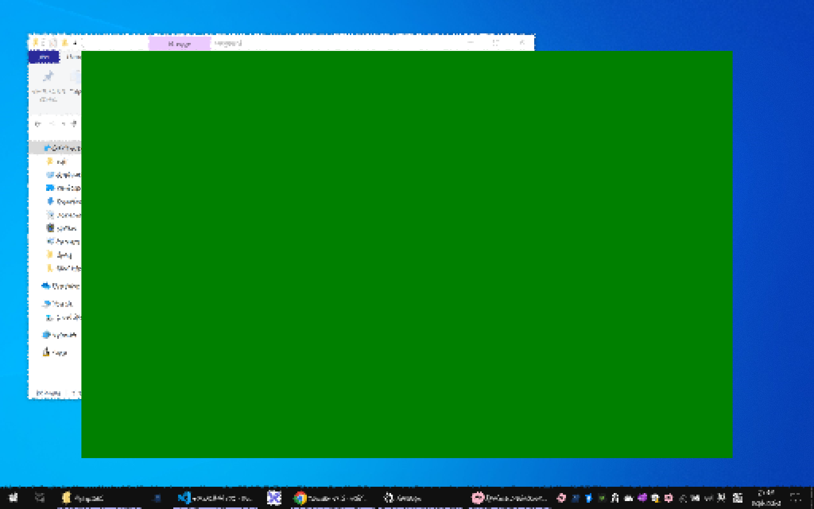

EyeGuard is an application designed with one primary goal in mind: to safeguard and protect your precious eyesight.

# Configuration
Here's a sample configuration file
```
[UserSettings]
workTime=28
breakTime=3

[SysSettings]
minWorkTime=3
maxWorkTime=45
minBreakTime=1
maxBreakTime=15
```

# Splash image
You can replace the splash image by placing `bg.png` in the root directory of the executable.

# Snapshots
## default splash


## customized splash (demo)


## config window


## tray icon


